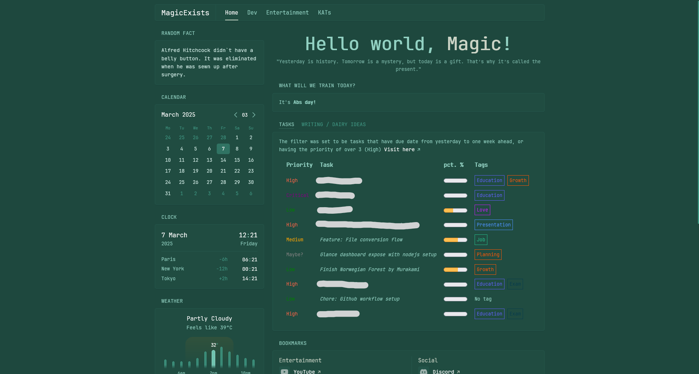
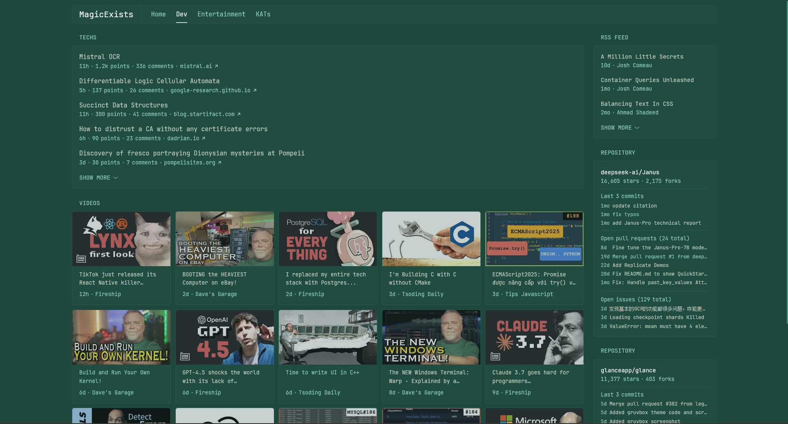
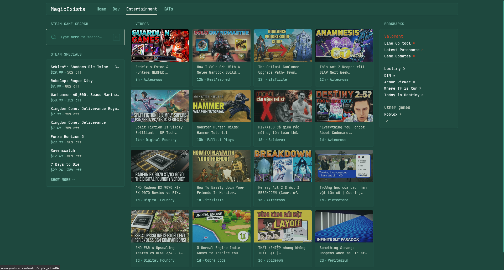
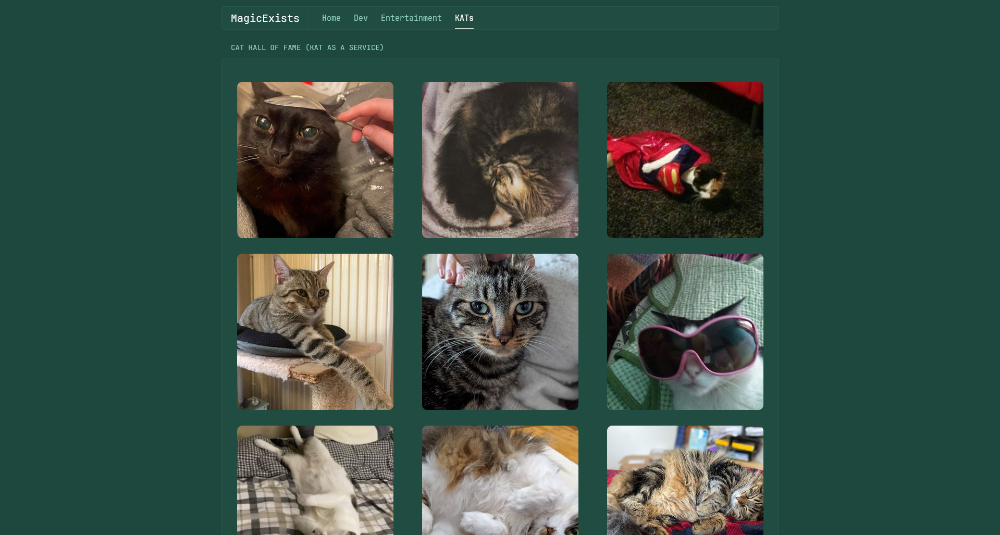

# Glance Template

My own [glance dashboard](https://github.com/glanceapp/glance) customization, feel free to pull this and config it to your need

## Prerequisites
- Vikunja (Integration with Vijkunja, which is another self-hosted project management, but I'm using it as a personal task management)
- Actual (self-hosted budget tracker, WIP to make a custom widget with the api)

## Installation
Just pull this repo (or download just the `glance.yml` file separately), place the configuration file within your glance directory, and start it with the executable.

It's assumed that you've already set up Vikunja and Actual, here're some env to be set before running the with this configuration:

| Name                       | Value  | Description                                                                                              |   |   |
|----------------------------|--------|----------------------------------------------------------------------------------------------------------|---|---|
| VIKUNJA_HOST               | Number | The host in which you run Vikunja                                                                        |   |   |
| VIKUNJA_PORT               | Number | The port in which you run Vikunja                                                                        |   |   |
| VIKUNJA_GLANCE_API_TOKEN   | String | The API token of Vikunja that has the permission to read tasks                                           |   |   |
| VIKUNJA_IDEAS_PROJECT_ID   | Number | The `ideas` project id, I have this env set up as I want to track contents for my future writing topics  |   |   |
| VIKUNJA_WORKOUT_PROJECT_ID | Number | THe `workout` project id, tracking today's workout routine                                               |   |   |

## Feature sections include
- [x] Home directory
- [x] Development directory
- [x] Entertainment directory
- [x] KATs (Cats hall of fame, features [Cat as a Service](https://cataas.com/))
- [ ] Actual Budget tracker (WIP)

## Screenshot
### Homepage

### Dev

### Entertainment

### Kats
This last section is optional for cat lovers 🐈
